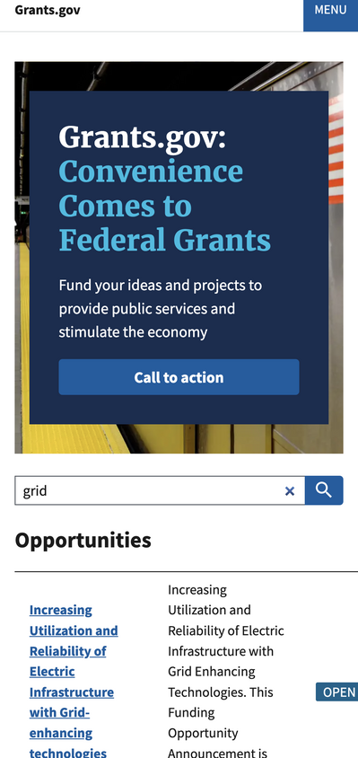
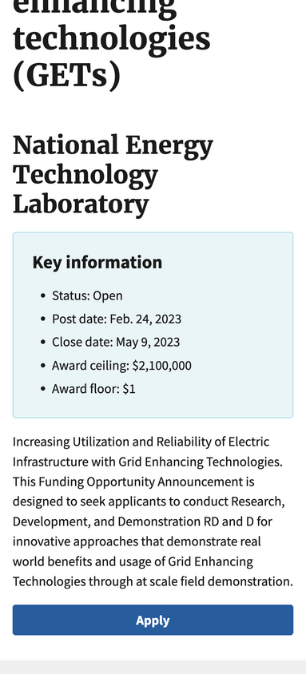

# beta.grants.gov demo

This is a demonstration of an alternative frontend UI for grants.gov.





## Details

- Django 4.1.7
- Elasticsearch 8.x
- SQLite 3
- [USWDS 3.0][uswds]

[uswds]: https://designsystem.digital.gov/ "U.S. Web Design System"

## Steps to make a quick prototype of beta.grants.gov

- Get the Grants.gov XML db dump
- Convert to JSON
- Intermediate: use XML schema to generate the XML-to-JSON Go program
- Make the Django project and the opportunity model
- Migrate to create SQLite db
- Insert JSON into SQLite db via SQL with `json_extract()`
- Optional: install Elasticsearch and start it up
- Make documents.py and rebuild search index
- `npm install uswds`
- Make base template with uswds
- Create SERP template
- Make Django search view

## Installation and how to run demo locally

*Pre-requisite*: an instance of Elasticsearch running somewhere

- git clone this repo
- `pip install -r requirements.txt`
- `npm install`
- edit ./grantsdotgov/grantsdotgov/settings.py for connection details of
  Elasticsearch
- download Grants.gov XML db and extract to XML in grantsdotgov directory
- cd grantsdotgov
- go run grantsxmltosqlite.go < GrantsDBExtract20230307v2.xml > output.json
- sqlite3 db.sqlite3 < insert.sql
- yes | python manage.py search_index --rebuild
- python manage.py runserver

```
MIT License

Copyright (c) 2023 Ad Hoc

Permission is hereby granted, free of charge, to any person obtaining a copy
of this software and associated documentation files (the "Software"), to deal
in the Software without restriction, including without limitation the rights
to use, copy, modify, merge, publish, distribute, sublicense, and/or sell
copies of the Software, and to permit persons to whom the Software is
furnished to do so, subject to the following conditions:

The above copyright notice and this permission notice shall be included in all
copies or substantial portions of the Software.

THE SOFTWARE IS PROVIDED "AS IS", WITHOUT WARRANTY OF ANY KIND, EXPRESS OR
IMPLIED, INCLUDING BUT NOT LIMITED TO THE WARRANTIES OF MERCHANTABILITY,
FITNESS FOR A PARTICULAR PURPOSE AND NONINFRINGEMENT. IN NO EVENT SHALL THE
AUTHORS OR COPYRIGHT HOLDERS BE LIABLE FOR ANY CLAIM, DAMAGES OR OTHER
LIABILITY, WHETHER IN AN ACTION OF CONTRACT, TORT OR OTHERWISE, ARISING FROM,
OUT OF OR IN CONNECTION WITH THE SOFTWARE OR THE USE OR OTHER DEALINGS IN THE
SOFTWARE.
```
